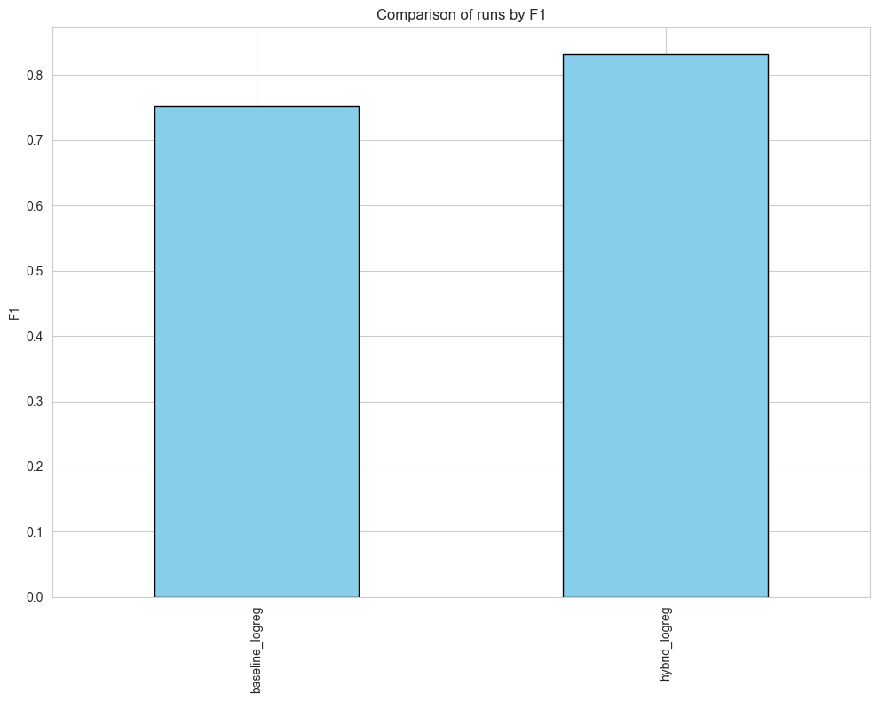
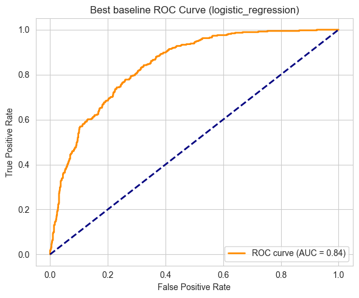
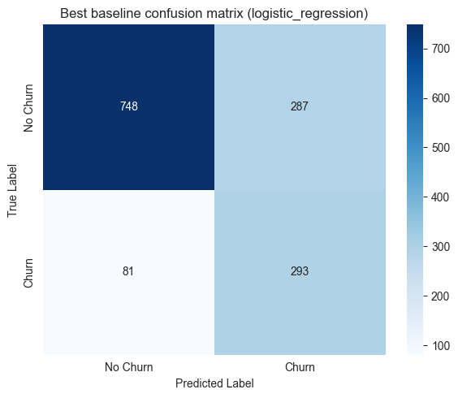
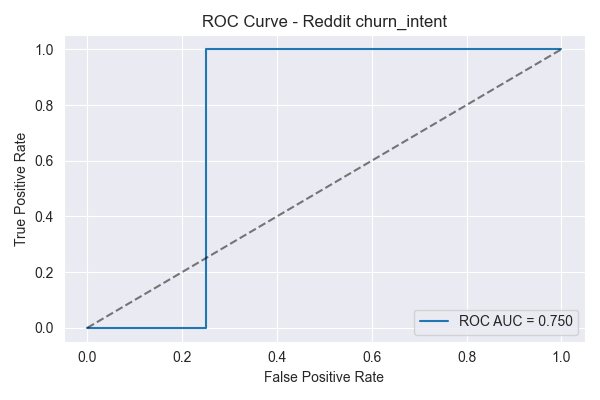
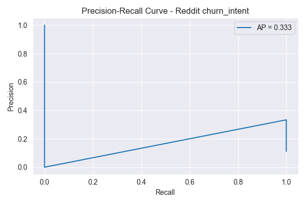
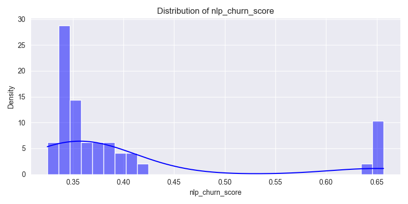
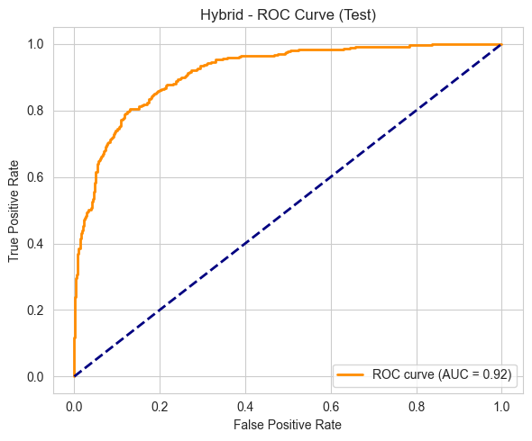

# ByeBye Predictor 📉

Hybrid Telco churn prediction with structured data + text-based intent

End-to-end churn modeling project that combines **Telco structured data** (tenure, billing, contract) with **text-based churn intent** extracted from Reddit comments. Simulated project for a Telco provider to support smarter, earlier customer retention decisions.

---

## TL;DR (Quick Facts)

- **Problem type:** Binary classification – Will the customer churn? (Yes / No)
- **Use case:** Telco customer retention – prioritize high-risk customers using both billing/usage data and signals hidden in text (tickets, chats, social posts, forums).
- **Algorithms:**
  - Structured churn: Logistic Regression, tree-based models (via a custom `ModelBuilder`)
  - Text churn-intent: Logistic Regression over TF‑IDF + SVD
  - Hybrid churn: Logistic Regression using structured + synthetic text-derived aggregates
- **Key ideas:**
  - Build a **clean Telco churn pipeline** from raw data to model evaluation.
  - Train a **text classifier** on Spanish Reddit comments to detect churn intent.
  - Integrate text-based risk signals into a **hybrid churn model**.
- **Stack:** Python, Pandas, NumPy, Scikit-learn, TF‑IDF + SVD for Spanish NLP, Matplotlib, Seaborn, Jupyter, custom utilities under `src/`

---

## Business Context

Telecom companies lose significant revenue when customers churn.Typical structured drivers:

- Contract type (month-to-month vs long-term),
- Payment method (electronic check vs automatic credit card),
- Monthly charges and total charges,
- Tenure and service bundle.

However, many **early churn signals appear in text**:

- Complaints in tickets and chats (“me voy a cambiar de compañía”),
- Negative comments on social media or forums,
- CRM notes from call center interactions.

A traditional model that only sees billing and usage may:

- React **too late**, after the customer has already decided to leave.
- Miss “silent churn” customers who voice frustration but haven’t changed their plan yet.

This project simulates how a Telco could:

1. Build a solid **baseline churn model** using structured data.
2. Train an **NLP model** to detect churn intent in Spanish text.
3. Design a **hybrid churn model** that uses both sources to better target retention campaigns.

---

## Objective

Predict whether a Telco customer will churn using:

1. **Structured features** from a curated Telco churn dataset, and
2. **Text-based churn-intent signals** derived from Reddit comments.

And deliver a clear, reproducible workflow:

- From:
  - Data collection and cleaning,
  - Through feature engineering and modeling,
  - To evaluation, comparison, and model persistence.

Concretely, the project:

- Explores and cleans both **Telco** and **Reddit** datasets.
- Engineers:
  - Telco features suitable for churn modeling,
  - Heuristic churn-intent labels and text features from Reddit.
- Trains and compares:
  - Structured churn models,
  - A Reddit churn-intent model,
  - A hybrid churn model that integrates both.
- Evaluates performance with **business-relevant metrics** (F1, ROC–AUC, PR–AUC).
- Saves final models for possible integration in applications or APIs.

---

## Project Structure

```text
byebye-predictor/  
│  
├── data/
|   ├── raw/                                                   # Original Telco + Reddit data + metadata
│   ├── iterim/                                                # Iterim data
│   └── processed/                                             # Cleaned & curated datasets
│       ├── telco_churn_curated.csv                            # Telco structured features (no customerID)
│       ├── target_processed.csv                               # Binary churn target (0/1), aligned by index
│       ├── reddit_comments_labeled.csv                        # Reddit comments + heuristic churn_signal
│       ├── reddit_comments_with_nlp_score.csv
│       └── telco_nlp_churn_aggregates_synthetic.csv
│
├── notebooks/
│   ├── 00_project_overview.ipynb
│   ├── 01_data_acquisition.ipynb
│   ├── 02_eda.ipynb
│   ├── 03_telco_data_preprocess.ipynb
│   ├── 04_telco_baseline_model.ipynb
│   ├── 05_telco_feature_engineering.ipynb
│   ├── 06_reddit_commets_nlp.ipynb
│   ├── 07_reddit_churn_intent_nlp_model.ipynb                     
|   ├── 08_hybrid_churn_model_integration.ipynb           
│   └── notebooks_setup.py                                  # ADD PROJECT_ROOT
│
├── models/
|   ├── baseline/  
|   ├── feature_enginnering/  
│   ├── hybrid-model/
│   └── preprcessors/
│ 
├── reports/
│   └── figures/
│       ├── baseline-model-telco/                         # Telco churn plots (ROC, PR, confusion, etc.)
|       ├── eda/                                          # EDA reports
│       ├── feature-engineering-model-telco/              # Plots, product engineering features
│       ├── reddit-comments-nlp/                         # Text model plots
│       └── hybrid-model/                                # Baseline vs hybrid comparison plots
│
├── src/
│   ├── __init__.py
│   ├── data_loader.py                                 # Empty "init" file
│   ├── eda.py                                        # EDA helpers (distributions, correlations, etc.)
│   ├── feature_engineering.py                        # Engineering techniques of characteristics
│   ├── model_builder.py                              # ModelBuilder: CV, model selection, final training
│   ├── model_evaluation.py                        # ModelEvaluator: metrics, ROC/PR curves, confusion matrices
│   ├── preprocess.py                              # TextCleaner for Spanish Reddit comments
│   └── utils.py                                   # Logging, paths, and small shared utilities
│
├── tests/                                         # Test content for all functions defined in the 'src/' directory
|   ├── test_data_loader.py  
|   ├── test_eda.py 
│   ├── test_feature_engineering.py
│   ├── test_model_builder.py
│   ├── test_model_evaluation.py
│   ├── test_preprocess.py
│   └── test_utils.py
│
├── .gitignore                                     # Files not included for the remote repository
├── pyproject.toml                                 # Project configuration and build settings
└── README.md                                      # This File
```

---

## Highlights & Results

### 1. Telco Structured Churn Modeling

Using the curated Telco dataset:

* **Curated features** in telco_churn_curated.csv:
  Tenure, contract type, payment method, monthly charges, etc.
* **Target** in target_processed.csv:
  Binary churn column (0/1), aligned by index with the feature matrix.
* **Pipeline**:

  - Data loading, cleaning, and preprocessing (missing values, encoding, scaling).
  - Model training through a custom ModelBuilder class that:
    * Registers candidate models (e.g., Logistic Regression, tree-based methods).
    * Runs k-fold cross-validation.
    * Selects the best configuration based on test metrics (e.g., F1).
* **Evaluation:**

  - Confusion matrix,
  - ROC curve,
  - Precision–Recall curve,
  - Summary metrics (Accuracy, Precision, Recall, F1, ROC–AUC).

This forms a production-style baseline churn model using only structured data.

### 2. Reddit Churn-Intent Model - Notebook 07

***Notebook: 07_reddit_churn_intent_nlp_model.ipynb***

* **Data**:

  - reddit_comments_labeled.csv with Spanish comments about Telco providers.
  - Heuristic label churn_signal indicating explicit churn intent.
* **Features & Model**:

  - X = body, y = churn_signal.
  - churn_text_model Scikit-learn Pipeline
    * TextCleaner for:
      - Lowercasing,
      - Removing URLs, punctuation, digits,
      - Removing Spanish stopwords.
    * Flatten step to turn the text column into a 1D array.
    * TfidfVectorizer with:
      - Up to 5000 features,
      - 1–2 grams.
    * TruncatedSVD for dimensionality reduction.
    * LogisticRegression(class_weight="balanced", max_iter=1000).
* **Outputs**:

  - nlp_churn_score = churn_text_model.predict_proba(body)[:, 1] for each comment.
  - Enriched dataset ***reddit_comments_with_nlp_score.csv*** saved under ***data/processed/.***
  - Plots (in reports/figures/reddit-comments-nlp/):
    * Confusion matrix against churn_signal,
    * ROC curve for churn-intent detection,
    * Precision–Recall curve.
* **EDA**:

  - Distribution of nlp_churn_score,
  - Boxplot of scores by churn_signal.

This model turns ***unstructured text*** into a ***probabilistic churn-intent signal*** that can be aggregated and fed into downstream churn models.

### 3. Hybrid Churn Model (Structured + Text) – Notebook 08

**Notebook: 08_hybrid_churn_model_integration.ipynb**

This notebook connects everything:

* Loads the curated Telco dataset and target.
* Simulates customer-level aggregates derived from ``nlp_churn_score``.
* Builds and compares:
  - A baseline Telco churn model (structured only)
  - A hybrid churn model (structured + text-derived features).

#### *Synthetic text-based aggregates*

For each Telco customer (row), the notebook simulates:

* ``nlp_churn_score_max_30d`` – Max churn-intent score in the last 30 days.
* ``nlp_churn_score_mean_90d`` – Mean churn-intent score in the last 90 days.
* ``nlp_churn_high_risk_count_30d`` – Count of high-risk interactions (score > 0.8) in the last 30 days.

These features are:

* Correlated with actual churn (churn) to behave like realistic signals.
* Stored in text_features_df and persisted as
  telco_nlp_churn_aggregates_synthetic.csv under data/processed/.
* Explored with plot_numerical_distributions from src/eda.py.

#### *Baseline vs Hybrid feature spaces*

* **Baseline (X_base)**:
  - All Telco features except the churn target.
  - Numeric vs categorical split inferred from Pandas dtypes.
* **Hybrid (X_hybrid)**:
  - Same structured features as X_base, plus:
    * ``nlp_churn_score_max_30d``
    * ``nlp_churn_score_mean_90d``
    * ``nlp_churn_high_risk_count_30d``

Both use the same target ***y = churn.***

#### ***Modeling with ModelBuilder***

* Preprocessing:
  - Numeric:
    * SimpleImputer(strategy="median")
    * StandardScaler
  - Categorical:
    * SimpleImputer(strategy="most_frequent")
    * OneHotEncoder(handle_unknown="ignore")
  - Combined via ColumnTransformer with separate numeric/categorical branches.
* Models:
  - ``baseline_logreg:`` Logistic Regression trained on X_base.
  - ``hybrid_logreg:`` Logistic Regression trained on X_hybrid (with extended numeric space including text-based aggregates).
* Workflow:
  - Shared train/test split with stratification on churn.
  - 5-fold cross-validation on the training set using ModelBuilder.evaluate_models.
  - Final training with ``ModelBuilder.train_final_model`` for both baseline and hybrid configs.

#### ***Evaluation with ModelEvaluator***

* Evaluate both models on the held-out test set using *ModelEvaluator*:
  - Metrics:
    * Accuracy
    * Precision
    * Recall
    * F1
  - Plots (saved in reports/figures/hybrid-model/):
    * Confusion matrix for baseline and hybrid models.
    * ROC curves for baseline vs hybrid.
    * Precision–Recall curves for both.
  - A comparison chart summarizing F1 scores (baseline vs hybrid).

Even though the aggregates are simulated, the pattern typically shows:

- Higher F1 for the hybrid model,
- Better ROC–AUC and PR–AUC,
- Improved detection and ranking of true churners.

#### ***End-to-End hybrid scoring demo***

The notebook includes a scoring example:

* Take a real row from X_hybrid_test.
* Override only the three text-aggregate features to simulate:
  - A spike in recent churn intent (higher max/mean),
  - More high-risk interactions.
* Run ``hybrid_final.predict_proba`` on this row to obtain a churn probability.
* Log and interpret the result, illustrating how text-derived risk shifts the prediction.


#### ***Hybrid model – Current performance (Logistic Regression, structured + text)***

On the held-out test set, the hybrid churn model (structured Telco data + synthetic text-derived aggregates) achieves approximately:

| Metric     | Value  |
|-----------|--------|
| Accuracy  | 0.825  |
| Precision | 0.853  |
| Recall    | 0.825  |
| F1-score  | 0.832  |

These results confirm that the hybrid approach is not only conceptually sound, but also delivers a strong, production-style baseline for Telco churn prediction.

#### Baseline vs Hybrid – Test F1 comparison

| Model                 | Features                            | F1-score |
|-----------------------|-------------------------------------|---------:|
| Baseline (structured) | Telco structured data only          | 0.76     |
| Hybrid                | Structured + text-derived features  | 0.83     |


#### Visual Hybrid model – Baseline vs hybrid comparison (F1)




---

## Visuals

### Telco baseline – ROC curve and confusion matrix






### Reddit churn-intent model – ROC & PR curves






### Distribution of `nlp_churn_score`




### Hybrid model – ROC curves




---

## Installation & Setup

### 1. Create a virtual environment

```bash
python -m venv .venv
```

#### Activate it:

**Linux / macOS:**

```bash
source .venv/bin/activate
```

**Windows:**

```bash
.venv\Scripts\activate
```

### 2. Install dependencies

This project uses **`pyproject.toml`** for dependency management.

Install dependencies with:

```bash
pip install .
```

(or your preferred workflow with pipx, uv, or poetry if you adapt the project)

---

## How to Run the Project

*1. Activate your virtual environment (if not already active).*

*2. Start Jupyter Notebook from the project root:*

```bash
jupyter notebook
```

*3. From the Jupyter interface, you can follow this flow:*

- ***Telco structured churn:***

  * 01_data_acquisition.ipynb
  * 02_eda.ipynb
  * 03_telco_data_preprocess.ipynb
  * 04_telco_baseline_model.ipynb
  * 05_telco_feature_engineering.ipynb
- ***Reddit churn-intent model:***

  * 06_reddit_commets_nlp.ipynb
  * 07_reddit_churn_intent_nlp_model.ipynb
- ***Hybrid structured + text churn model:***

  * 08_hybrid_churn_model_integration.ipynb

### Running these notebooks will:

* Recreate the processed datasets in ``data/processed/``.
* Train and evaluate Telco churn models.
* Train the Reddit churn-intent model and compute ``nlp_churn_score``.
* Simulate and evaluate the hybrid churn model.
* Save the final hybrid model under ``models/hybrid-model/churn_hybrid_model.joblib``.

---

## Tech Stack

* **Languages:** Python
* **Data & ML:** Pandas, NumPy, Scikit-learn
* **NLP:** Custom `TextCleaner` for Spanish, TF‑IDF + n‑grams, TruncatedSVD (LSA), stopword removal, NLTK
* **Visualization:** Matplotlib, Seaborn
* **Environment:** Jupyter Notebook
* **Project structure:** Modular utilities under `src/` for data loading, EDA, feature engineering, modeling, and evaluation
* **Model persistence:** joblib (`.joblib`)

---

## Roadmap / Next Steps

- [ ] Real text–Telco integration
  * Replace synthetic aggregates with real customer-level nlp_churn_score computed from
    actual interactions linked via customerID.
- [ ] More models and tuning
  * Add XGBoost / LightGBM baselines for the Telco and hybrid setups.
  * Integrate hyperparameter tuning and cross-validation more deeply into ModelBuilder.
- [ ] API layer
  * Wrap churn_text_model and churn_hybrid_model into a simple prediction API
    (e.g., FastAPI) for real-time or batch scoring.

---

## Author

***Flavio Aguirre***
Data Science · Python · Applied Machine Learning

LinkedIn: https://www.linkedin.com/in/flavio-aguirre-12784a252/ <br>
GitHub: https://github.com/flavioaguirre  <br>
Email: flavioaguirre0@gmail.com <br>
